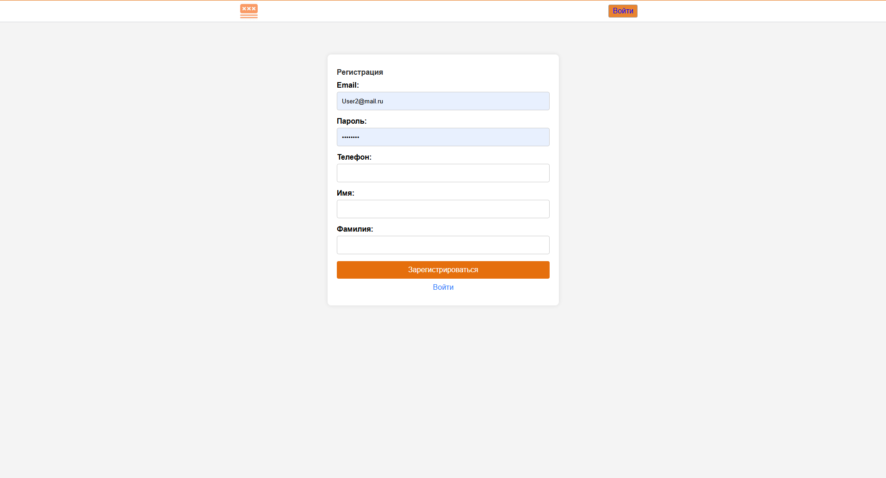
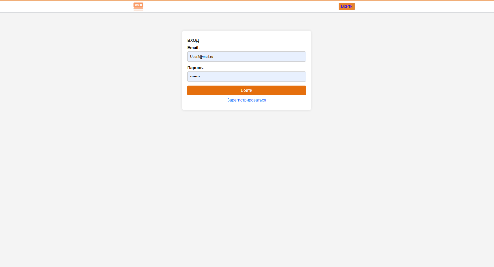
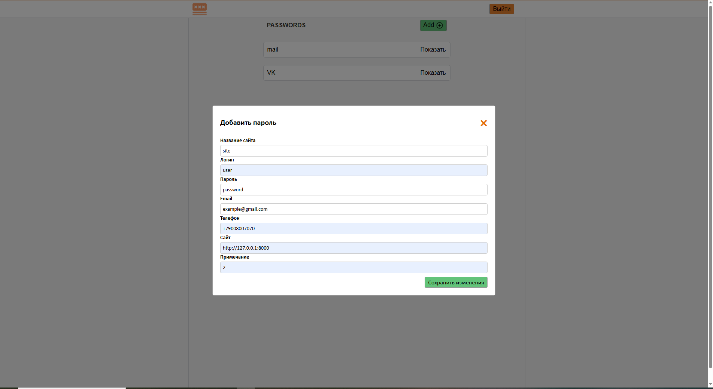
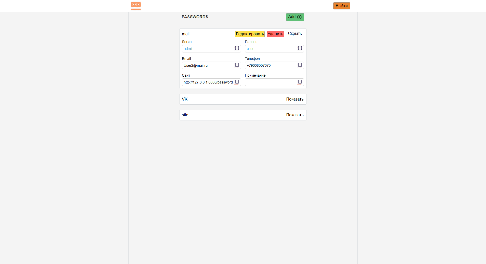
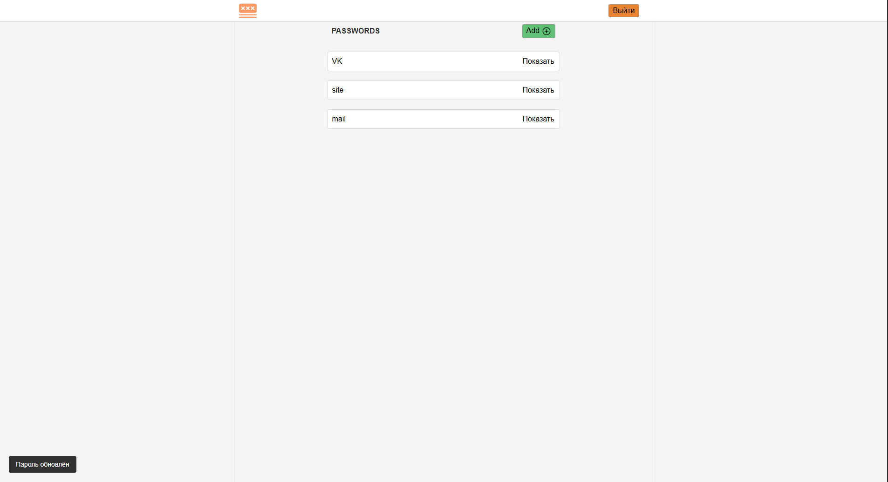
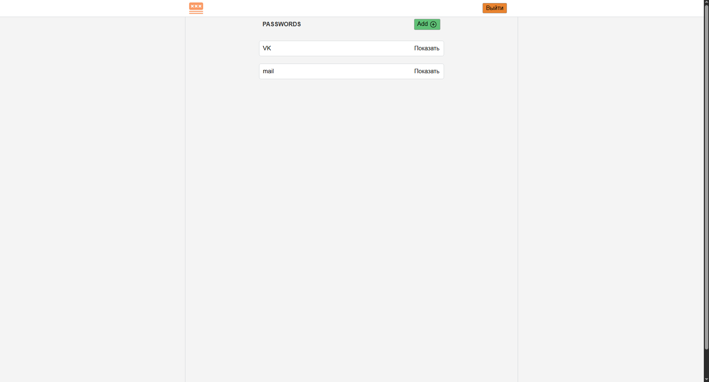

# PasswordStorage - Облачное хранилище паролей

## что бы создать базу данных можно воспользоваться таким способом:
1. Cоздать файл ```docker-compose.yml```
2. Примерное содержимое файла вы найдете в аналогичном файле здесь
3. выполнить команду ```docker-compose up -d```
4. сменить рабочий каталог ```cd app```
5. выполнить ```alembic init -t async migration```
6. в файле ```alembic.ini``` заменить ```script_location = migration``` на ```script_location = app/migration```
7. сменить каталог ```cd ../```
8. в файле ```app/migration/env.py``` в начале после имеющихся импортов: 
```
import sys
from os.path import dirname, abspath
sys.path.insert(0, dirname(dirname(abspath(__file__))))
from app.database import DATABASE_URL, Base
from app.passwords.models import Password
from app.users.models import User
config = context.config
config.set_main_option("sqlalchemy.url", DATABASE_URL)"
```
9. в файле ```app/migration/env.py``` заменить ```target_metadata = None``` на ```target_metadata = Base.metadata```
10. переместить файл ```alembic.ini``` в корневой каталог ```PasswordStorage```
11. выполните команду ```alembic revision --autogenerate -m "init"```
12. выполните команду ```alembic upgrade head```

## что потребуется установить
```
pip install alembic asyncpg sqlalchemy pydantic-settings
pip install pydantic-settings
pip install jinja2
pip install python-jose bcrypt==4.0.1 passlib[bcrypt]
```
## Запуск локального сервера
```uvicorn app.main:app```










